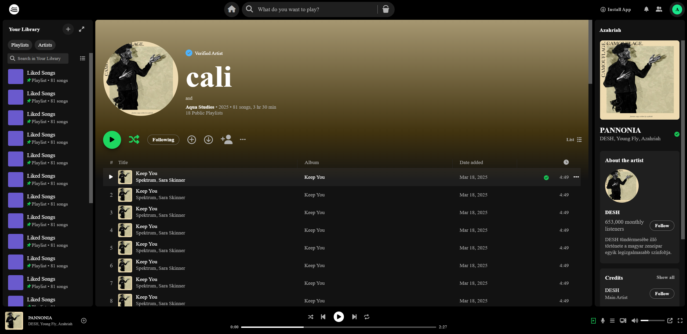
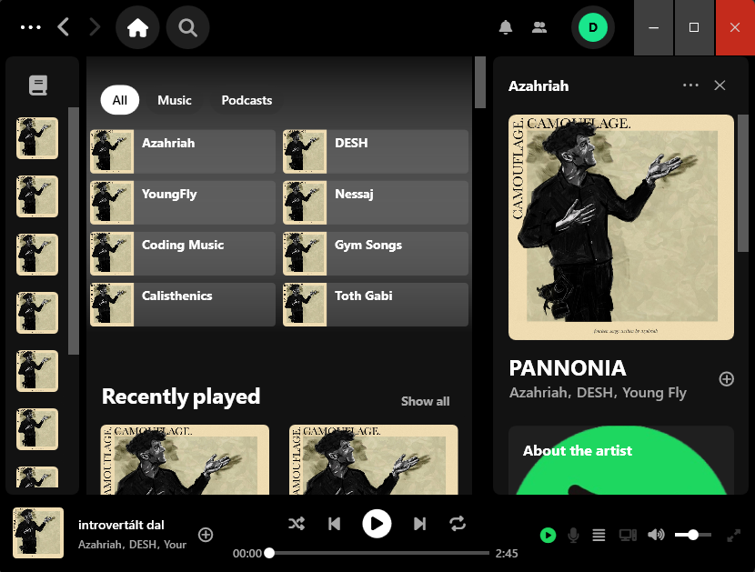
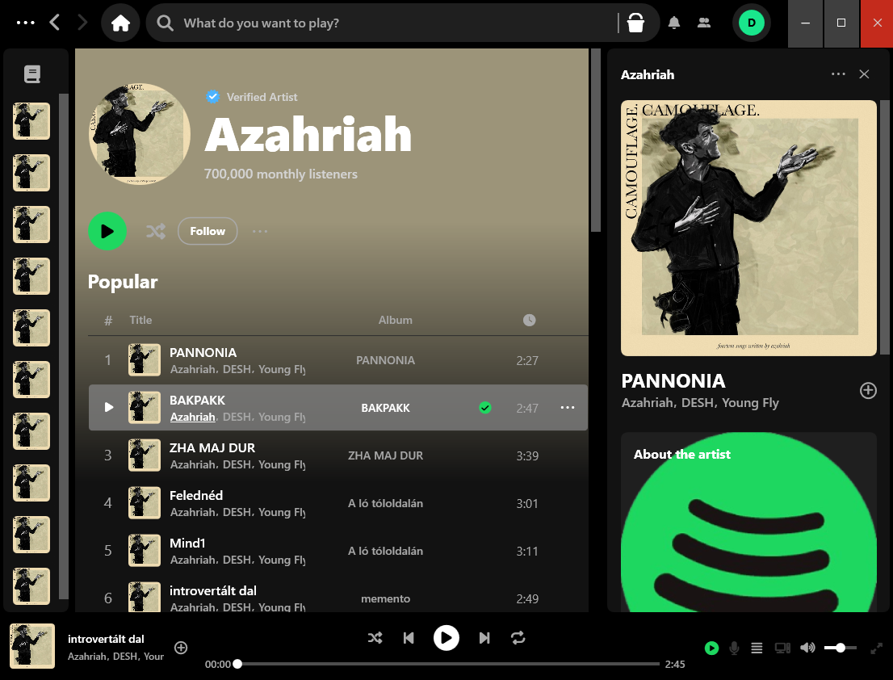
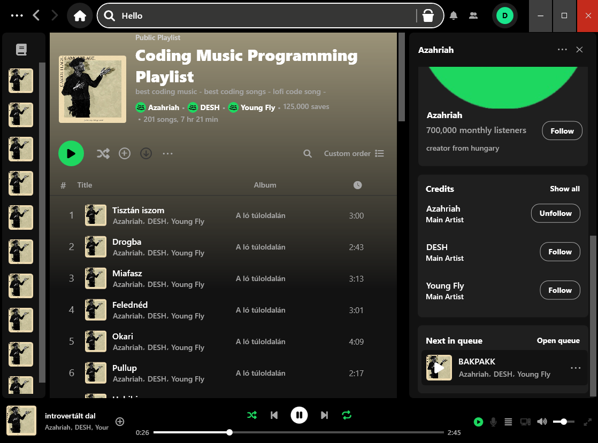
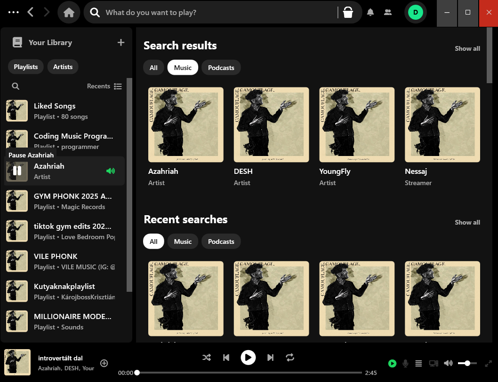

# Stopify
Stopify is a Spotify-inspired desktop application built with **WPF + MVVM** on **.NET 8**, backed by a layered domain and persistence stack using **Entity Framework Core (SQL Server)**. The solution combines a production-style architecture (repositories, unit of work, services, migrations) with a UI focused on modern desktop UX patterns and interaction behaviors.

## Overview

- **Problem solved**: Provides a foundation for a music streaming client—catalog (songs/albums/artists), user library (saved playlists/albums/artists), and playback-related data (queue, recents, history)—with a desktop UI that mirrors the interaction model of Spotify-like players.
- **Who it is for**: Recruiters and senior developers evaluating **WPF/MVVM**, layered architecture, EF Core data modeling, and clean separation of concerns in a real-world domain.
- **Main goals**:
  - Build a rich **WPF UI** using MVVM, commands, converters, and attached behaviors.
  - Implement a maintainable backend/domain layer with explicit services and repositories.
  - Model a realistic music domain and persist it with EF Core migrations and relational constraints.

## Screenshots

### Web Mockup (Full Screen)


### Home Page - Desktop


### Artist Details - Desktop


### Playlist Details - Desktop


### Search Details - Desktop


## Architecture

### Architecture style

- **Layered Architecture** with a clear separation between:
  - **Domain** (entities, contracts, business services)
  - **Infrastructure** (EF Core persistence, repository implementations, external integrations)
  - **Presentation** (WPF UI following **MVVM**)

### Project structure (actual repository layout)

- `Stopify.Presentation/` (**WPF Presentation, MVVM**)
  - `Views/`: WPF UI (XAML) for `Home`, `Search`, `Artist`, `Playlist`, `NowPlaying`, `Queue`, plus reusable components.
  - `ViewModels/`: ViewModels for each screen + shared UI models.
  - `Utilities/Commands/`: `ICommand` implementations used by the ViewModels.
  - `Utilities/Behaviors/`: Attached behaviors for UI interactions (animations, sizing, sticky header, media slider interaction, etc.).
  - `Utilities/Converters/`: Value converters used by XAML.
  - `Utilities/Stores/`: UI state stores (`NavigationStore`, `UIState`) enabling navigation and layout collapse/expand coordination.

- `Stopify.Domain/` (**Domain layer**)
  - `Entities/`: Core domain entities (e.g., `User`, `Song`, `Album`, `Artist`, `Playlist`, etc.).
  - `Contracts/`: Abstractions for repositories, unit of work, and services.
  - `Services/`: Domain services orchestrating operations using repositories via `IUnitOfWork`.
  - `DTOs/`: DTO models used for some operations.
  - `Other/`: Domain utilities (e.g., email verification workflow, storage service abstraction).

- `Stopify.Infrastructure/` (**Infrastructure layer**)
  - `Persistence/`: EF Core `StopifyDbContext`, migrations, unit of work, and repository implementations.
  - `Other/`: External integration implementations (e.g., Azure Blob Storage context for audio files).
  - `InfrastructureDependencies.cs`: DI wiring for DbContext, repositories, SMTP client, and storage.

- `Stopify.Exceptions/`
  - Custom exception types (primarily validation-related exceptions).

- `Stopify.ConsoleTest/`
  - Console project for ad-hoc testing/invocation.

- `clients/stopify-web/`
  - A separate React/Vite client plus **HTML/CSS mockups** (`clients/stopify-web/mockups/`) demonstrating Spotify-like layout ideas and styling assets.

### Key runtime wiring

The WPF app (`Stopify.Presentation/App.xaml.cs`) loads configuration from `Stopify.Presentation/appsettings.json` and wires DI:

- Domain dependencies (`AddDomainDependencies`)
- Infrastructure dependencies (`AddInfrastructureDependencies`)
- Presentation dependencies (views, viewmodels, stores)

## Technologies Used

### Backend / Domain

- **.NET 8**
- **BCrypt.Net** for password hashing (`BCrypt.Net-Next`)
- **Dependency Injection** via `Microsoft.Extensions.DependencyInjection`
- **Configuration** via `Microsoft.Extensions.Configuration.Json`

### Desktop UI

- **WPF** (`net8.0-windows`, `UseWPF=true`)
- **MVVM** (ViewModels, `ICommand`, stores, converters, behaviors)
- **WPF Media playback** via `System.Windows.Media.MediaPlayer` (used in the player ViewModel/behaviors)

### Database / Persistence

- **SQL Server**
- **Entity Framework Core 8** (`Microsoft.EntityFrameworkCore`, `SqlServer`, migrations)

### External services / Integrations

- **Azure Blob Storage** (`Azure.Storage.Blobs`) via `Stopify.Infrastructure/Other/AzureBlobContext.cs`
- **SMTP email sending** via `System.Net.Mail.SmtpClient` (configured for Gmail SMTP in DI)

### Design patterns used (implemented in code)

- **MVVM** (Presentation layer)
- **Repository pattern** (`Stopify.Domain/Contracts/Repositories/*`, implementations in `Stopify.Infrastructure/Persistence/Repositories/*`)
- **Unit of Work** (`Stopify.Infrastructure/Persistence/UnitOfWork.cs`, exposed as `IUnitOfWork`)
- **Dependency Injection** for composition root
- **Attached Behaviors** in WPF for reusable UI interaction logic

## Core Features (implemented in code)

### WPF UI (Presentation layer)

- **Multi-pane layout** (titlebar, sidebar/library, main content, now-playing panel, queue panel, bottom player bar).
- **Navigation system** based on `NavigationStore.CurrentViewModel` and data templates (Home/Search/Artist/Playlist).
- **Interactive UI behaviors**:
  - Sticky header behavior on scroll (Home view).
  - Search bar expand/collapse behaviors (titlebar + sidebar library).
  - Media scrubber interactions (dragging the playback slider updates time and seeks the `MediaPlayer`).
  - Hover popups, animations (foreground/background/scale), and responsive sizing behaviors.

> Note: Many ViewModels currently contain **static/demo data** to drive the UI while backend wiring is developed.

### Domain + Persistence capabilities

- **User lifecycle and profile updates** (`UserService`):
  - Create user with uniqueness checks (username/email).
  - Update username, email, password, first/last name, avatar (with validation and verification-code workflow via email service).
- **Library-related operations** (services exist for):
  - Saving albums, following artists, saving playlists (via `UserAlbumService`, `UserArtistService`, `UserPlaylistService`, etc.).
- **Playback data model**:
  - Queue entries (`SongQueue`)
  - Recently played (`RecentPlayed`)
  - Playback history (`PlaybackHistory`)
- **Catalog model**:
  - Albums, artists, songs, genres, countries, playlists with relations and constraints.

## Technical Highlights

- **WPF MVVM implementation with behavior-driven UX**
  - Extensive use of attached behaviors to keep XAML clean while enabling complex UI interactions (e.g., media bar seeking, sticky header, animated hover states, responsive layout changes).
- **EF Core model with realistic constraints**
  - Unique indexes (e.g., unique `Users.Username`, `Users.Email`, `Artists.Name`, `Albums.Title`, `Genres.Name`, `Countries.Name`).
  - Filtered unique index for public playlists: `Playlists.Title` is unique **only when** `IsPublic = 1`.
- **Relational modeling of many-to-many relations**
  - Album–Artist, Song–Artist, Song–Genre implemented as join tables (`AlbumArtists`, `SongArtists`, `SongGenres`).
- **External storage abstraction**
  - Audio file storage accessed through `IAudioStorageContext` and implemented with Azure Blob Storage (`AzureBlobContext`), enabling future swapping/mocking.

## Database Design

### Main entities (EF Core)

- **User**
- **Song**
- **Album**
- **Artist**
- **Playlist**
- **Genre**
- **Country**
- **PlaybackHistory**
- **RecentPlayed**
- **SongQueue**
- Join entities:
  - **SongPlaylist** (Song ↔ Playlist, includes `Position`)
  - **UserAlbum**, **UserArtist**, **UserPlaylist**
  - **UserFollower** (self-referencing follow graph)

### Key relationships (high level)

- **Album ↔ Artist**: many-to-many (`AlbumArtists`)
- **Song ↔ Artist**: many-to-many (`SongArtists`)
- **Song ↔ Genre**: many-to-many (`SongGenres`)
- **Song ↔ Album**: optional many-to-one (`Songs.AlbumId` nullable)
- **Playlist ↔ Song**: many-to-many with ordering (`SongPlaylists(Position)`)
- **User ↔ Queue/Recents/History**: one-to-many
- **User ↔ User (followers)**: many-to-many self-reference via `UserFollowers`

### Notable constraints / indexing (from migrations / model)

- Unique indexes:
  - `Users(Username)`, `Users(Email)`
  - `Artists(Name)`, `Albums(Title)`, `Songs(Title)`, `Genres(Name)`, `Countries(Name)`
- Filtered unique index:
  - `Playlists(Title)` unique where `IsPublic = 1`
- Default timestamps:
  - `Users.DateJoined` default `GETDATE()`
  - `PlaybackHistories.PlaybackDateTime` default `GETDATE()`
  - `UserArtists.FollowedDate`, `UserFollowers.FollowedDate`, `UserPlaylists.SavedDate` default `GETDATE()`

## How to Run the Project

### Requirements

- **Windows 10/11**
- **.NET SDK 8.x**
- **SQL Server** (LocalDB, SQL Server Express, or full SQL Server)
- (Optional) **Azure Storage account** if you want Blob Storage integration enabled
- (Optional) SMTP credentials if you want the email verification workflow to work

### Configuration (`appsettings.json`)

The WPF app expects a JSON config file at:

- `Stopify.Presentation/appsettings.json`

Create it with at least these connection strings (names are important—they are read by code):

```json
{
  "ConnectionStrings": {
    "StopifyDbContext": "Server=(localdb)\\MSSQLLocalDB;Database=Stopify;Trusted_Connection=True;TrustServerCertificate=True;",
    "EmailSender": "<smtp_app_password_or_secret>",
    "StopifyStorage": "<azure_blob_connection_string>"
  }
}
```

### Database setup & migrations

EF Core migrations are located in:

- `Stopify.Infrastructure/Persistence/Migrations/`

From the repository root, run:

```bash
dotnet tool restore
dotnet ef database update --project Stopify.Infrastructure
```

If `dotnet ef` is not available, install it:

```bash
dotnet tool install --global dotnet-ef
```

### Run the WPF application

```bash
dotnet run --project Stopify.Presentation
```

### (Optional) Run the web client / mockups

The `clients/stopify-web/` folder is a separate React/Vite project and also includes static mockups under `clients/stopify-web/mockups/`.

```bash
cd clients/stopify-web
npm install
npm run dev
```

## Future Improvements

Based on the current structure, the most natural next steps are:

- **Wire UI to real data**
  - Replace demo/static ViewModel data with calls into domain services (and async-loading patterns appropriate for WPF).
- **Implement missing command logic**
  - Several `ICommand` implementations exist but are placeholders (e.g., navigation/playback commands).
- **Harden configuration & secrets management**
  - Move SMTP credentials and secrets out of connection strings and into secure secret storage (User Secrets/Key Vault/etc.).
- **Introduce an application layer (optional)**
  - The repo already has clear layering; adding a dedicated “application” layer could formalize use cases and isolate orchestration from the domain.
- **Improve audio playback pipeline**
  - Connect `MediaPlayer` to actual song sources (e.g., Azure Blob URIs via `IAudioStorageService`) and implement playlist/queue playback logic.
- **Add automated testing**
  - Unit tests for domain services and repository contracts; UI-level testing for behaviors where feasible.
- **Performance & UX**
  - Virtualization for large lists, caching for images, and improved async/await patterns to keep UI responsive.

## Author

- Author: Deinesh Trombola
- Role: .NET Developer
